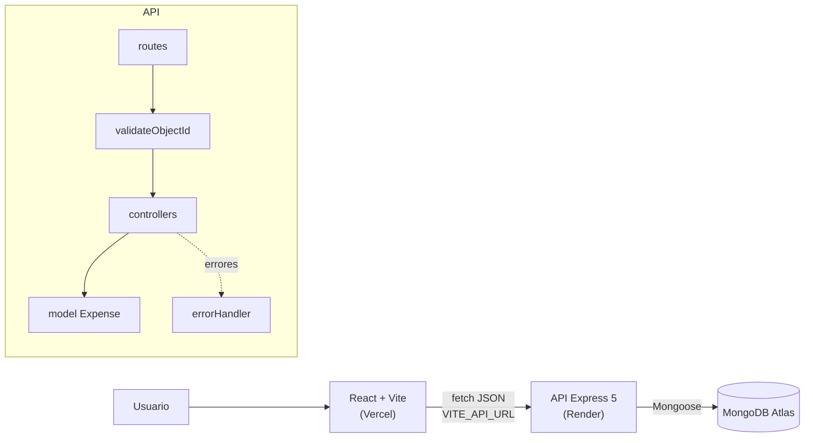
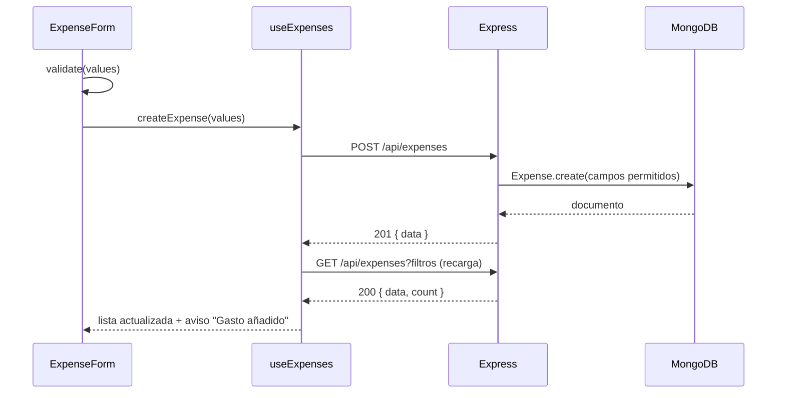

# Cuentas Claras

Apunta tus gastos y mira en qué se va tu dinero cada mes.

Mini aplicación fullstack con **CRUD completo** de gastos: React + Vite en el frontend, API REST con Node.js + Express, datos en MongoDB Atlas. Proyecto con IA de la **PEC 5 · Desarrollo Web Fullstack (CEI, 2025/2026)**.

| | URL |
| --- | --- |
| 🌐 Aplicación (Vercel) | `https://pec-full-2026-bxqh.vercel.app/`|
| ⚙️ API (Render) | `https://cuentas-claras-api-6n2h.onrender.com/` |
|Repositorio | [`https://github.com/adamadarmes-svg/pec-full-2026`](https://github.com/adamadarmes-svg/pec-full-2026) (carpeta `PEC 5`) |

## Funcionalidades

- **Crear** gastos con concepto, importe, fecha, categoría, método de pago y notas.
- **Listar** ordenados por fecha, con **filtros** por categoría y mes (se aplican en el servidor).
- **Editar** en el mismo formulario (en móvil, la vista baja sola hasta él).
- **Eliminar** con confirmación dentro de la fila.
- **Resumen**: total gastado y franja de reparto por categoría.
- Validación en el cliente **y** en el servidor, con el error debajo de cada campo.
- Diseño responsive (probado a 375 px y 1366 px), foco visible y `prefers-reduced-motion`.

## Stack

| Capa | Tecnología |
| --- | --- |
| Frontend | React 19, Vite 8, Tailwind CSS 4 |
| Backend | Node.js ≥ 20, Express 5, Mongoose 9, cors, dotenv |
| Base de datos | MongoDB Atlas |
| Despliegue | Vercel (frontend) · Render (API) |
| IA | Claude (Anthropic), ver [Uso de IA](#uso-de-ia) |

## Arquitectura





## Estructura

```
PEC 5/
├── backend/            API REST (Express + Mongoose)
│   ├── src/            config · models · controllers · routes · middleware · app.js · server.js
│   ├── requests/       expenses.http · expenses.postman.json
│   └── .env.example
├── frontend/           React + Vite + Tailwind
│   ├── src/            api · hooks · components · constants · utils
│   └── .env.example
├── .ai/agents/         definición de los agentes de IA
├── .ai/skills/         skills y prompts reutilizables
├── docs/screenshots/
├── PLAN.md · AGENTS.md · SKILLS.md · TASKS.md
├── render.yaml         blueprint de Render (opcional)
├── .gitignore · .gitattributes
```

## Instalación y ejecución en local

Requisitos: **Node.js 20 o superior** y una base de datos en **MongoDB Atlas** (gratis).

```bash
cd backend
npm install
cp .env.example .env 
npm run dev           

cd frontend
npm install
cp .env.example .env
npm run dev      
```

### Variables de entorno

| Archivo | Variable | Ejemplo | Descripción |
| --- | --- | --- | --- |
| `backend/.env` | `MONGODB_URI` | `mongodb+srv://…/cuentas-claras?…` | Conexión a Atlas (con nombre de BD) |
| | `PORT` | `4000` | Puerto local (Render pone el suyo) |
| | `NODE_ENV` | `development` / `production` | En producción oculta los errores 500 |
| | `CORS_ORIGIN` | `https://mi-app.vercel.app` | Orígenes permitidos, separados por comas |
| `frontend/.env` | `VITE_API_URL` | `http://localhost:4000` | URL de la API, sin barra final |

## API

Base: `/api/expenses`. Respuestas `{ data, message? }` o `{ error, details? }`.

| Método | Ruta | Descripción | Códigos |
| --- | --- | --- | --- |
| GET | `/api/health` | Estado de la API y la BD | 200 |
| GET | `/api/expenses?category=comida&month=2026-09` | Listar con filtros opcionales | 200, 400 |
| GET | `/api/expenses/meta` | Categorías y métodos válidos | 200 |
| GET | `/api/expenses/:id` | Obtener uno | 200, 400, 404 |
| POST | `/api/expenses` | Crear | 201, 400 |
| PUT | `/api/expenses/:id` | Actualizar (parcial) | 200, 400, 404 |
| DELETE | `/api/expenses/:id` | Eliminar | 200, 400, 404 |

Ejemplo de cuerpo:

```json
{ "title": "Compra semanal", "amount": 54.37, "category": "comida", "date": "2026-09-20", "paymentMethod": "tarjeta", "notes": "" }
```

### Pruebas

- **REST Client**: abre `backend/requests/expenses.http` y pulsa _Send Request_. "Crear gasto" guarda el id para los siguientes.
- **Postman / Thunder Client**: importa `backend/requests/expenses.postman.json`. Incluye tests (códigos de estado) y guarda `expenseId` automáticamente; se puede lanzar entera con _Run collection_.

## Despliegue

**Orden: Atlas → Render → Vercel → volver a Render para CORS.**

### 1. MongoDB Atlas
1. Crea un cluster gratuito (M0).
2. _Database Access_ → usuario con contraseña (sin `@ : / ? #` para evitar problemas).
3. _Network Access_ → _Add IP Address_ → `0.0.0.0/0` (Render no tiene IP fija).
4. _Connect → Drivers_ → copia la URI y añade el nombre de la base antes del `?`: `…mongodb.net/cuentas-claras?retryWrites=true&w=majority`.

### 2. API en Render
1. _New → Web Service_ → conecta el repositorio de GitHub.
2. **Root Directory**: `backend` (si el repo contiene la carpeta `PEC 5`, entonces `PEC 5/backend`).
3. **Runtime** Node · **Build** `npm install` · **Start** `npm start` · **Plan** Free.
4. _Environment_: `MONGODB_URI`, `NODE_ENV=production`, `CORS_ORIGIN` (de momento vacía).
5. _Advanced → Health Check Path_: `/api/health`.
6. Comprueba `https://tu-api.onrender.com/api/health` → `"database": "conectada"`.


### 3. Frontend en Vercel
1. _Add New → Project_ → importa el repositorio.
2. **Root Directory**: `frontend` (o `PEC 5/frontend`). Vercel detecta Vite solo.
3. _Environment Variables_: `VITE_API_URL=https://tu-api.onrender.com` (sin barra final).
4. _Deploy_.

### 4. Cerrar CORS
En Render, pon `CORS_ORIGIN=https://tu-app.vercel.app` y guarda (se redespliega solo). Prueba la app: crear, editar, borrar.

## Uso de IA

### Herramientas
- **Claude (Anthropic)**, en claude.ai, modelo Claude Opus 5.5, con ejecución de código: generó el código, lo instaló, lo probó en un entorno aislado (pruebas de la API sin BD, capturas en navegador a 375 y 1366 px) y redactó la documentación.
- **Claude Code** (extensión de VS Code): lo usé ya con el proyecto en mi ordenador, para revisar el código que había generado, entender las partes que no tenía claras, limpiar código que sobraba y repasar la documentación antes de entregar.

### Reparto del trabajo
| Parte | Generada por IA | Revisado / hecho por mí |
| --- | --- | --- |
| Idea, entidad y plan | ✅ propuesta | Elegí la idea y validé campos y alcance |
| Backend completo | ✅ | Lectura del código, pruebas con `.http` contra mi Atlas |
| Pruebas `.http` y Postman | ✅ | Ejecución y comprobación de respuestas |
| Frontend completo | ✅ | Pruebas en navegador y en mi móvil |
| Diseño visual | Primera versión | ✅ lo rehíce: paleta oscura, animaciones, marcos y encuadres |
| Documentación | ✅ borrador | Revisión y reflexión personal |
| Git, Atlas, Render, Vercel | Guía paso a paso | ✅ lo hice yo |

### Prompts principales
Resumen en [SKILLS.md](SKILLS.md#prompts-principales-usados); los prompts completos y reutilizables están en [`.ai/agents/`](.ai/agents/) y [`.ai/skills/`](.ai/skills/). El prompt inicial fue, en resumen:

> Necesito hacer un proyecto completo hecho por ti. Una aplicación fullstack con React, en JS o TS, con Next o Vite. Yo me encargo de la gestión general y tú de todo el código.

A partir de ahí fui cambiando de rol en cada fase (planificador, backend, frontend, revisor y despliegue) en vez de pedirlo todo de golpe, porque así las respuestas eran más cortas y los errores se veían mejor.

### Errores de la IA y correcciones

Errores **reales** detectados durante el desarrollo:

| # | Error | Cómo se detectó | Corrección |
| --- | --- | --- | --- |
| E1 | Al crear la estructura de carpetas usó una sintaxis de bash (`{a,b}`) en una shell `sh`: creó una carpeta llamada literalmente `{backend` e instaló las dependencias en la carpeta equivocada | Salida del comando (`can't cd`) | Borrado y repetido con `bash` |
| E2 | Iba a usar `findByIdAndUpdate(…, { new: true })` por costumbre; en **Mongoose 9** (la versión instalada) está obsoleto | Leyendo los tipos en `node_modules/mongoose/types/query.d.ts` | `returnDocument: 'after'` |
| E3 | Un origen bloqueado por CORS devolvía **500** (error del servidor) y un stack trace en el log | Prueba con `Origin: https://malo.com` | `HttpError(403)` |
| E4 | El botón "Eliminar" salía gris en vez de rojo: `text-danger` añadido no ganaba a `text-muted` de la variante | Captura de pantalla | Variante propia `dangerGhost` |
| E5 | Los `<select>` de filtros salían en negrita (heredaban `font-semibold` del `<label>`) | Captura de pantalla | `font-normal` en `inputClass` |
| E6 | Al arrancar la API en local contra mi Atlas no conectaba: fallaba la resolución DNS de la dirección del cluster | Al hacer `npm run dev` salía `❌ No se pudo conectar a MongoDB` y el proceso se cerraba | Lo arreglé en la parte de la conexión hasta que el `/api/health` devolvió `"database": "conectada"` |
| E7 | Había código que sobraba: cosas generadas "por si acaso" que no se usaban en ninguna parte | Revisando archivo por archivo, también con ayuda de Claude Code | Lo borré y comprobé que el CRUD seguía funcionando igual |
| E8 | Algunas rutas no estaban como yo las necesitaba | Probando la app y las peticiones del `.http` | Las corregí a mano |

### Decisiones propias
Ver la tabla completa en [PLAN.md](PLAN.md#6-decisiones-principales). Además de esas, hubo cosas que decidí yo:

- **Rehacer el diseño**: el que salió al principio funcionaba pero no me convencía. Lo cambié a un tema oscuro con un verde menta como color de acento, marcos con esquinas que se abren al pasar el ratón y un color propio para cada categoría. Todo sigue en los tokens de `index.css`, sin colores sueltos en los componentes.
- **Animaciones con medida**: entradas suaves de los paneles, la barra del resumen que crece, el aviso que se vacía cuando desaparece… pero si el sistema tiene activado `prefers-reduced-motion`, se quitan.
- **Menos es más**: si una parte del código no se usaba, fuera. Prefiero entender todo lo que entrego a tener cosas "por si acaso".

## Reflexión

**¿Qué fue más rápido gracias a la IA?** Todo lo repetitivo: la estructura de carpetas, el modelo con sus validaciones, los cinco controladores, el `.http` y la colección de Postman con sus tests, y la documentación. Lo que a mano se lleva unas horas la AI lo hace en pocos minutos. 

**¿Qué fue más difícil de controlar?** Que el código se ve correcto pero no lo es, error de cors devolvía 500 y la app funcionaba igual, solo salió al probar un caso concreto. También las versiones. la IA escribe por costumbre lo que se usaba en versiones anteriores (Mongoose 8), y hay que comprobarlo contra lo que realmente se ha instalado incluso usa versiones muy viejas de librerias o dependencias que ya no se usan.

**¿Qué errores aparecieron?** borre la mayor cantidad de codigo basura que vi o encontre con ayuda, el problema de dns que se soluciono con codigo, un conflicto de clases de tailwind y un problema de herencia de estilos. ninguno rompia o bajaba la app.

**¿Qué tuve que modificar?** todo el diseño estetico: varias animaciones diseños y encuadres, y la paleta de colores. También arregle los problemas del dns y algunas rutas. 

**¿Qué entendí mejor al revisar el código?** el orden de las carpetas es mas importante de lo que parece.  cuando haces un PUT con findbyidandupdate, mongoose no revisa las reglas del schema a menos que de le pida. El abortcontroller corta la petición anterior antes de que pueda devolver respuesta haciendo que la respuesta vieja no llegue después o remplace a la nueva.

**¿Volvería a usar IA para una aplicación similar?** Si para generar la base y la documentación, lo que aporta valor es probar cada parte y pedir a la IA que revise su propio código con otro rol. 

## Autoría

Andrés Felipe Adarmes · CEI · Desarrollo Web Fullstack · 2025/2026
