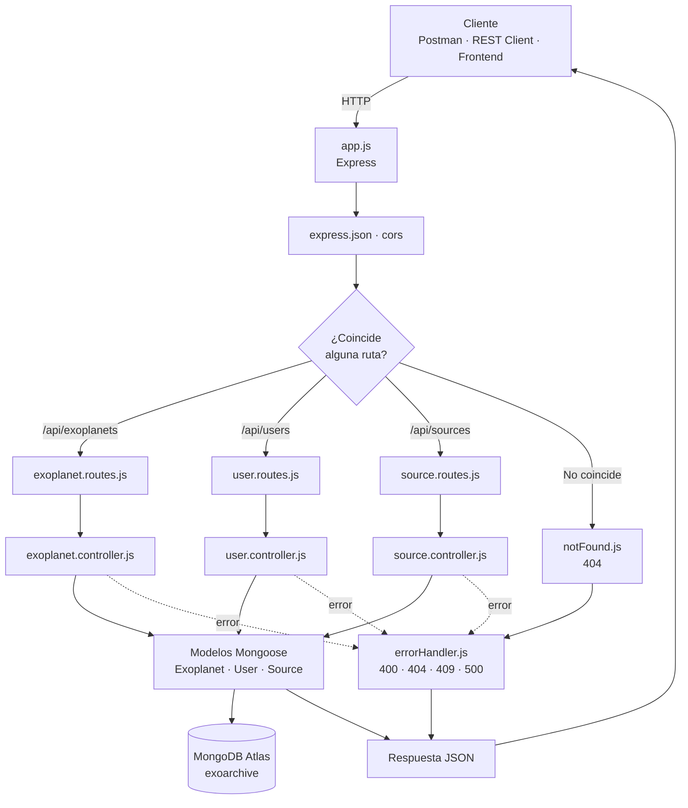
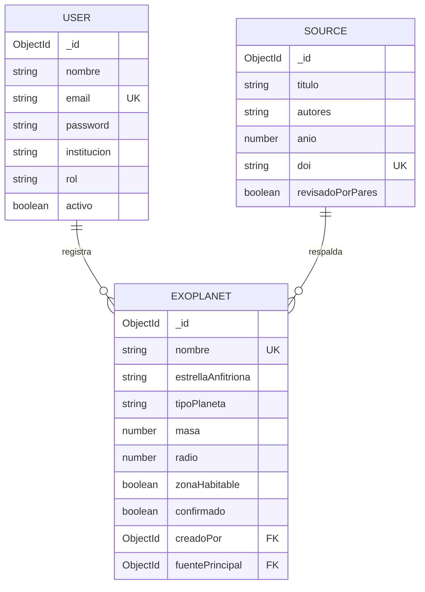

# EXO-ARCHIVE API

API REST para catalogar exoplanetas y vincular cada registro a su fuente
de investigación. Construida con **Node.js**, **Express** y **Mongoose**,
conectada a **MongoDB Atlas** y desplegada en **Vercel**.

Continuación de la PEC 1 (diseño y modelo de datos) y la PEC 2 (base de
datos desplegada en Atlas).

- **API en producción:** `https://TU-PROYECTO.vercel.app`
- **Repositorio:** `https://github.com/TU-USUARIO/TU-REPO`

---

## El proyecto

Los datos de exoplanetas se publican en catálogos dispersos y se corrigen
a medida que mejora la instrumentación. Esta API centraliza esos registros
y obliga a que cada uno apunte a la publicación científica que lo respalda,
de modo que ningún dato queda huérfano de fuente.

Los investigadores registrados pueden consultar el catálogo, añadir
descubrimientos, actualizar mediciones y retirar registros descartados.

---

## Arquitectura



### Estructura de carpetas

```
backend/
├── src/
│   ├── config/
│   │   └── db.js                    # conexión a Atlas (con caché)
│   ├── models/
│   │   ├── User.js
│   │   ├── Exoplanet.js
│   │   └── Source.js
│   ├── controllers/
│   │   ├── exoplanet.controller.js
│   │   ├── user.controller.js
│   │   └── source.controller.js
│   ├── routes/
│   │   ├── exoplanet.routes.js
│   │   ├── user.routes.js
│   │   └── source.routes.js
│   ├── middlewares/
│   │   ├── notFound.js              # 404
│   │   └── errorHandler.js          # 500 y demás
│   └── app.js                       # configura Express
├── server.js                        # arranque local y export para Vercel
├── vercel.json
├── .env                             # NO se sube a GitHub
├── .env.example
├── .gitignore
├── requests.http
└── exoarchive.postman_collection.json
```

Cada capa tiene una única responsabilidad: las **rutas** solo enlazan un
endpoint con su función, los **controladores** contienen la lógica, los
**modelos** definen la forma de los datos y sus validaciones, y los
**middlewares** se ocupan de lo transversal.

---

## Modelos

### Exoplanet — entidad principal

| Campo | Tipo | Obligatorio | Notas |
|---|---|---|---|
| `nombre` | String | Sí | Único |
| `estrellaAnfitriona` | String | Sí | |
| `tipoEspectral` | String | No | |
| `tipoPlaneta` | String | No | Terrestre · Supertierra · Tipo-Neptuno · Gigante gaseoso · Desconocido |
| `masa` | Number | No | Masas terrestres (M⊕), ≥ 0 |
| `radio` | Number | No | Radios terrestres (R⊕), ≥ 0 |
| `periodoOrbital` | Number | No | Días, ≥ 0 |
| `temperaturaEquilibrio` | Number | No | Kelvin, ≥ 0 |
| `distancia` | Number | No | Años luz, ≥ 0 |
| `metodoDescubrimiento` | String | No | Tránsito · Velocidad radial · Imagen directa · Microlente · Astrometría · Otro |
| `anioDescubrimiento` | Number | No | Entre 1988 y el año actual |
| `zonaHabitable` | Boolean | No | Por defecto `false` |
| `confirmado` | Boolean | No | Por defecto `false` |
| `descripcion` | String | No | |
| `imagen` | String | No | URL |
| `fuentePrincipal` | ObjectId → `Source` | No | Relación N:1 |
| `creadoPor` | ObjectId → `User` | No | Relación N:1 |

### User

| Campo | Tipo | Obligatorio | Notas |
|---|---|---|---|
| `nombre` | String | Sí | |
| `email` | String | Sí | Único, con validación de formato |
| `password` | String | Sí | Encriptada con bcrypt, `select: false` |
| `institucion` | String | No | |
| `rol` | String | No | admin · investigador |
| `activo` | Boolean | No | Por defecto `true` |

### Source

| Campo | Tipo | Obligatorio | Notas |
|---|---|---|---|
| `titulo` | String | Sí | |
| `autores` | String | Sí | |
| `publicacion` | String | No | Revista o congreso |
| `anio` | Number | No | |
| `doi` | String | No | Único (sparse) |
| `url` | String | No | |
| `revisadoPorPares` | Boolean | No | Por defecto `false` |

Los tres esquemas llevan `timestamps: true`, que añade `createdAt` y
`updatedAt` automáticamente.

### Relaciones



Las relaciones son **por referencia**: el exoplaneta guarda el `_id` del
usuario y de la fuente. Al consultar se resuelven con `populate()`, que
devuelve los datos enlazados en lugar del identificador suelto.

---

## Endpoints

Base local: `http://localhost:4000` · Base en producción: la URL de Vercel.

### Generales

| Método | Ruta | Descripción |
|---|---|---|
| GET | `/` | Documentación de la API |
| GET | `/api/health` | Estado del servidor y de la conexión a Atlas |

### Exoplanetas — CRUD completo

| Método | Ruta | Descripción |
|---|---|---|
| GET | `/api/exoplanets` | Listar todos |
| GET | `/api/exoplanets/:id` | Obtener uno |
| POST | `/api/exoplanets` | Crear |
| PUT | `/api/exoplanets/:id` | Actualizar |
| DELETE | `/api/exoplanets/:id` | Eliminar |

El listado admite parámetros de consulta:

| Parámetro | Ejemplo | Efecto |
|---|---|---|
| `tipoPlaneta` | `?tipoPlaneta=Terrestre` | Filtra por categoría |
| `zonaHabitable` | `?zonaHabitable=true` | Solo los de la zona habitable |
| `metodoDescubrimiento` | `?metodoDescubrimiento=Tránsito` | Filtra por técnica |
| `buscar` | `?buscar=kepler` | Busca en el nombre, sin distinguir mayúsculas |
| `pagina` / `limite` | `?pagina=2&limite=10` | Paginación (límite máximo 100) |

### Usuarios y fuentes

| Método | Ruta | Descripción |
|---|---|---|
| GET | `/api/users` | Listar usuarios |
| GET | `/api/users/:id` | Obtener uno |
| POST | `/api/users` | Crear (encripta la contraseña) |
| GET | `/api/sources` | Listar fuentes |
| GET | `/api/sources/:id` | Obtener una |
| POST | `/api/sources` | Crear |

### Formato de las respuestas

Todas las respuestas son **JSON**. En las consultas correctas se devuelven
los datos directamente:

```json
[
  {
    "_id": "6871c0000000000000000001",
    "nombre": "Kepler-452 b",
    "estrellaAnfitriona": "Kepler-452",
    "tipoPlaneta": "Supertierra",
    "zonaHabitable": true,
    "fuentePrincipal": { "titulo": "Discovery and Validation of Kepler-452b", "anio": 2015 }
  }
]
```

Los errores siguen siempre la misma forma, la que definen los middlewares:

```json
{
  "error": "Validation Error",
  "mensaje": "Exoplanet validation failed: nombre: El nombre del exoplaneta es obligatorio"
}
```

### Códigos de estado

| Código | Cuándo |
|---|---|
| 200 | Consulta, actualización o borrado correctos |
| 201 | Recurso creado |
| 400 | Datos inválidos o identificador mal formado |
| 404 | Recurso o ruta inexistente |
| 409 | Valor duplicado en un campo único |
| 500 | Error interno |

---

## Instalación y ejecución

Requisitos: Node.js 18 o superior y un clúster de MongoDB Atlas.

```bash
# 1. Clonar e instalar
git clone https://github.com/TU-USUARIO/TU-REPO.git
cd TU-REPO
npm install

# 2. Configurar las variables de entorno
cp .env.example .env
#    y editar .env con la cadena de conexión real

# 3. Arrancar
npm run dev     # con recarga automática (nodemon)
npm start       # sin recarga
```

El servidor queda en `http://localhost:4000`.

### Variables de entorno

| Variable | Obligatoria | Descripción |
|---|---|---|
| `MONGODB_URI` | Sí | Cadena de conexión de MongoDB Atlas, con la base al final (`/exoarchive`) |
| `PORT` | No | Puerto en local. Por defecto 4000; en Vercel se asigna solo |

El archivo `.env` está en el `.gitignore` y **nunca** se sube al
repositorio. `.env.example` documenta las variables sin exponer valores.

---

## Pruebas

Dos formatos incluidos, ambos con las mismas 23 peticiones:

**`requests.http`** — se ejecuta desde VS Code con la extensión
[REST Client](https://marketplace.visualstudio.com/items?itemName=humao.rest-client).
Basta con pulsar *Send Request* sobre cada bloque. La variable `@host`
permite alternar entre local y producción.

**`exoarchive.postman_collection.json`** — colección para Postman o Thunder Client.
Se importa con *Import → File*. La variable `baseUrl` apunta a local por
defecto; cámbiala a la URL de Vercel para probar producción.

Ambos archivos cubren el CRUD completo, los filtros, la paginación y los
casos de error (404 de ruta, identificador inválido, validaciones y
duplicados).

---

## Despliegue en Vercel

La API corre en Vercel como función serverless. Dos piezas lo hacen posible:

**`server.js`** exporta la aplicación con `module.exports = app` y protege
el arranque con `if (require.main === module)`. Así, en local se ejecuta
`app.listen()`, pero en Vercel —donde el archivo se importa en lugar de
ejecutarse— solo se exporta la app y la plataforma la invoca por petición.

**`src/config/db.js`** guarda la conexión en una variable global. Sin ese
caché, cada invocación abriría una conexión nueva y agotaría el límite del
clúster; con él, se reutiliza mientras la instancia siga viva.

Pasos: importar el repositorio en Vercel, añadir `MONGODB_URI` en
*Settings → Environment Variables* y desplegar. En Atlas, *Network Access*
debe permitir `0.0.0.0/0`, porque las IP de las funciones serverless no
son fijas.

---

## Decisiones técnicas

**Separación por capas.** Las rutas no contienen lógica y los controladores
no saben de HTTP más allá de la respuesta. Añadir una entidad nueva es
crear tres archivos y una línea en `app.js`.

**Errores centralizados.** Cada controlador envuelve su lógica en un
`try/catch` y reenvía el error con `next(err)`. El middleware
`errorHandler` lo recibe y lo traduce a un código HTTP con sentido:
`CastError` → 400, `ValidationError` → 400, clave duplicada (código 11000)
→ 409, y el resto → 500. Así el servidor nunca se cae y el cliente siempre
recibe un JSON con la misma forma.

**Validación en el esquema.** Rangos, enumeraciones y campos obligatorios
se declaran en el modelo, no en el controlador: la regla vive en un solo
sitio y se aplica igual venga de donde venga la escritura.

**Contraseñas.** Se encriptan con bcrypt en un hook `pre("save")` y el
campo lleva `select: false`, así que no salen en ninguna consulta.

---

## Con más tiempo

- Autenticación con JWT y rutas protegidas por rol.
- CRUD completo también en usuarios y fuentes (hoy solo lectura y creación).
- Limitación de peticiones por IP.
- Tests automáticos con Jest y Supertest.
